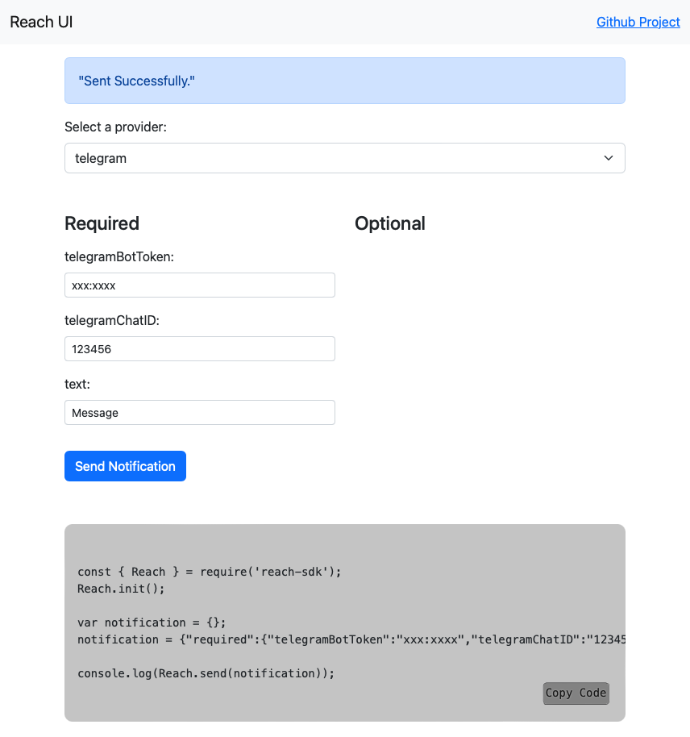

# Reach UI for Reach SDK
The Reach UI provides a simple web interface to test the functionality of each of the <A href="https://www.github.com/paschmann/reach-sdk" target="_blank">Reach SDK</a> providers. The Node.js web application lets you select the provider, and displays the corresponding required and optional parameters. You can input each of the parameters and test the functionality by sending a notification.

### What is the Reach SDK?

<A href="https://www.github.com/paschmann/reach-sdk" target="_blank">Reach SDK</a> is a open source node.js module for sending notifications focused on simplicity and extensibility. What's unique about this project? In most cases apps traditionally support a limited set of notification methods, such as email, push notifications or sms, but in some cases, users would prefer being notified in some other way, such as Slack, Whatsapp, Telegram or Discord, or even all of them. The <A href="https://www.github.com/paschmann/reach-sdk" target="_blank">Reach SDK</a> lets you or your app users select and configure their own notification methods, without needing to develop or implement each service.

# Installing

```
npm install
```

# Usage

```
npm run dev
```

This will start the test UI and provide the host and port. e.g.:

```
Test UI: http://localhost:8001
```

